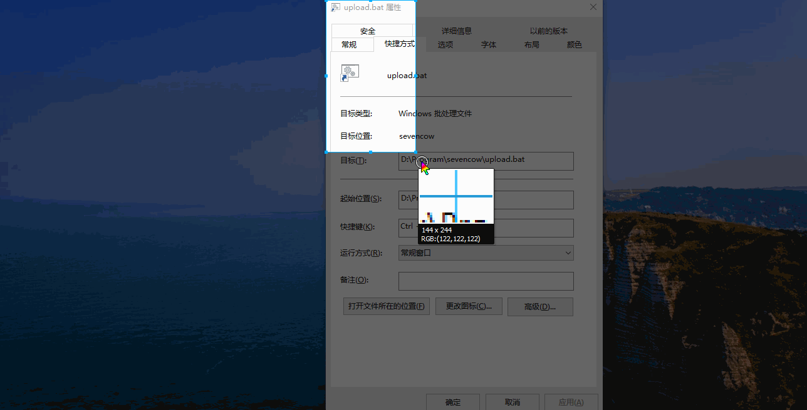

## 0x00 序言
写博客的时候插入图片是很麻烦的东西，很早之前就想做一个图片自动生成短链的工具，无奈拖沓，今晚终于开始动手了，其实挺简单的，晚上十一点开始写，凌晨一点就写好了，两个小时搞定 ;)
## 0x01 使用
1. 搭建环境
```
$ pip install qiniu
$ pip install win10toast
```
同时根据你的python的版本安装,安装 python32
```
https://sourceforge.net/projects/pywin32/files/pywin32/Build%20217/
```

2. 将你的七牛云账户的token填到对应的位置, 修改bucket的名字

3. 任意找一个截屏工具， 自带的`snippingtools`或者qq之类的，截屏。 运行该程序，该程序会自动将文件保存到七牛云，然后将链接放到剪切板， 粘贴即可

4. 修改一下bat文件，（我没写过win的批处理..我提供的文件不是很优雅)，然后右键发送到桌面快捷方式，接着在桌面右键该快捷方式的属性，添加快捷键


## 0x02 思路
当截屏的时候回把图像放到剪切板，这时候启动程序就会使用`win32api`读取剪切板内容，然后本地保存一份，接着上传到七牛云，然后上传成功就将图片的链接直接放到剪切板， 粘贴即可

## 0x03 使用方法


使用任意截屏工具截取内容到剪切板，然后按下快捷键（没添加快捷键的可以去双击bat文件），尔后会弹窗提醒上传完毕，外链地址会放到剪切板，在需要插入的地方粘贴即可

## 0x04 文件暂存 
另一个 `upload_tempfile`是将文件暂存到七牛云的，修改token和bucket之后即可
```
python upload_tempfile.py filename
```
稍后会打印出地址。
2017年7月9日01:30:07

赶紧睡觉，又修仙了
## changelog
#### 2017年7月13日01:14:08
修改了以前使用win32弹窗的方式提醒上传完毕，采用更友好的win10toast， 未测试在win10之外的系统上工作如何


#### 2017年7月13日20:03:56
v2ex上偶然看到一篇作者自己发的[帖子](https://www.v2ex.com/t/374418), 期间表达了对借用IPic的名字的软件比较介意。


于是询问一番。


鉴于ipic作者对我这个 **ipic-win** 的名字有点介意， 于是我修改了软件名字为 **pic2cloud-win**，说是修改其实就是改了下仓库名字，我本来就没打算给这个小程序名字的 :)


